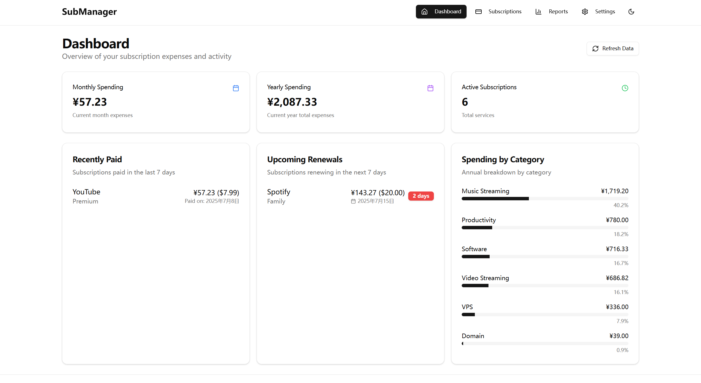
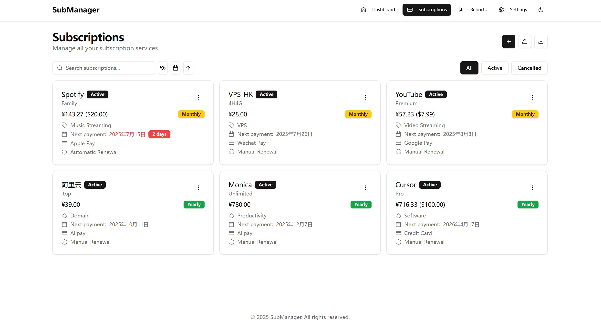
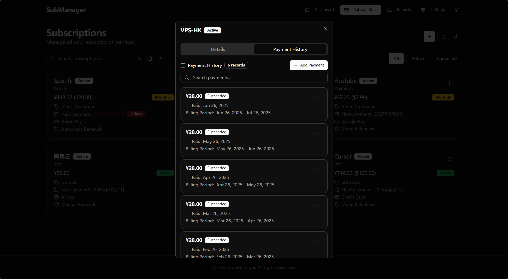
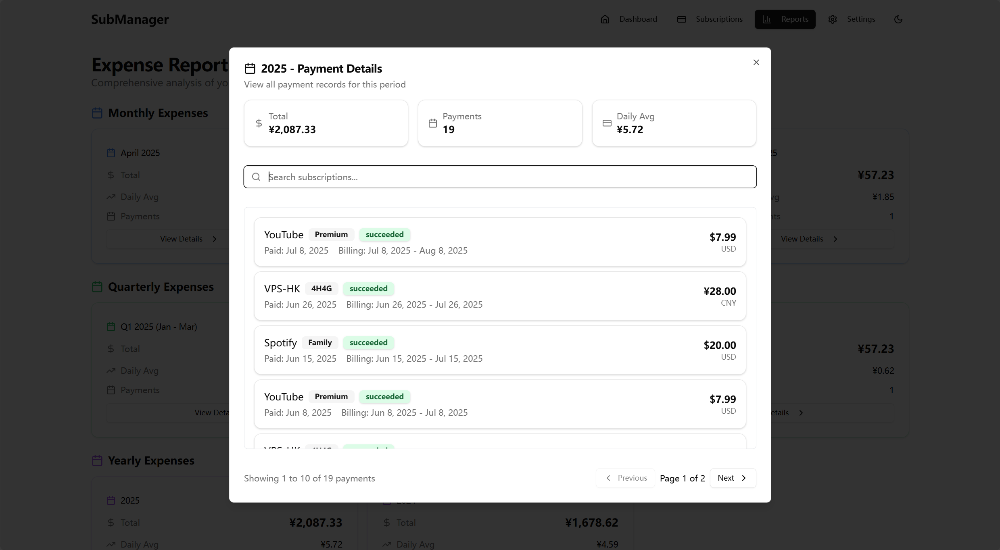
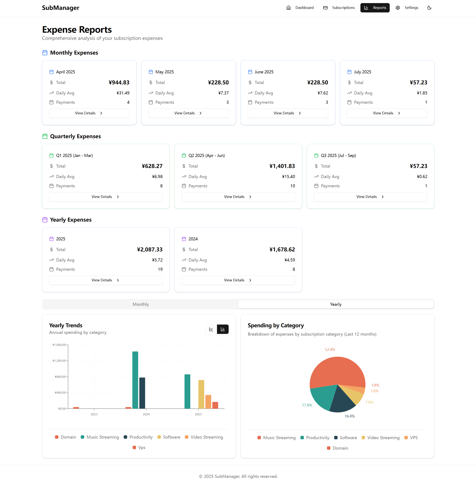
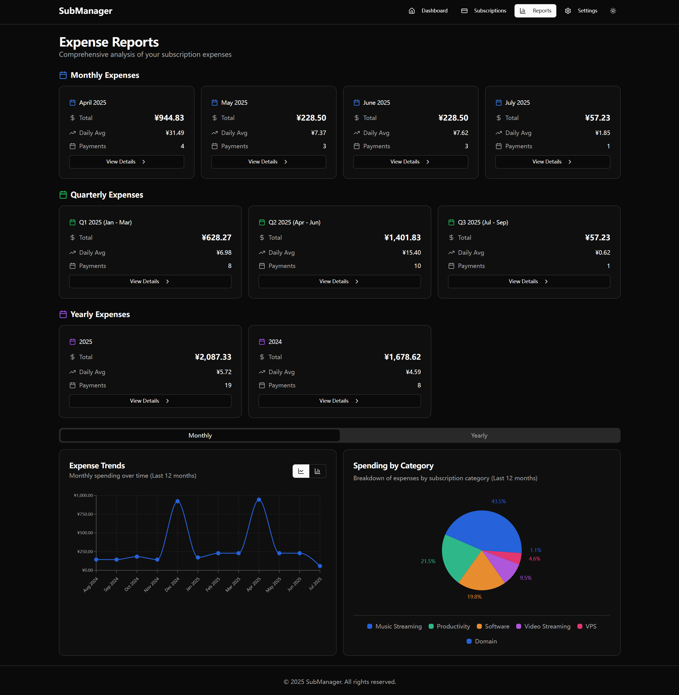

# Expense Subscription Nashik Management System

A modern subscription management system but also expense management system that helps users easily manage and track expenses and renewals for various subscription services.

## 📸 Interface Preview

### Dashboard - Smart Expense Overview

*Smart dashboard displaying monthly/yearly expense statistics, upcoming subscription reminders, and categorized expense analysis*

### Subscription Management - Complete Service Management

*Complete subscription lifecycle management with support for adding, editing, status management, and batch import*

### Payment History - Detailed Record Tracking

*Complete payment history records with search support and CRUD operations for orders*

### Monthly Expenses - Trend Analysis

*Monthly expense orders with intuitive display of spending details*

### Expense Reports - In-depth Data Analysis

*Powerful expense analysis features including trend charts, category statistics, and multi-dimensional data display*

### Dark Theme - Modern Interface

*Dark theme support*

## 🌟 Project Features

- **Smart Subscription Management** - Comprehensive subscription lifecycle management with automatic/manual renewal support
- **Multi-currency Support** - Support for 7 major currencies with real-time automatic exchange rate updates
- **Expense Analysis Reports** - Powerful data analysis and visualization chart functionality
- **Responsive Design** - Perfect adaptation for desktop and mobile devices
- **Local-first** - Local data storage based on SQLite for privacy protection
- **Docker Deployment** - One-click deployment, ready to use out of the box

## 📊 Feature Overview

### Core Features
- ✅ **Subscription Management** - Add, edit, delete subscription services
- ✅ **Smart Dashboard** - Expense overview and upcoming expiration reminders
- ✅ **Category Statistics** - Expense statistics by category and payment method
- ✅ **Search & Filter** - Multi-dimensional search and status filtering
- ✅ **Custom Configuration** - Custom categories and payment methods

### Advanced Features
- ✅ **Automatic Renewal Processing** - Smart detection of expiring subscriptions with automatic updates
- ✅ **Multi-currency Support** - Real-time conversion for 9 major currencies (USD, EUR, GBP, CAD, AUD, JPY, CNY, TRY, HKD)
- ✅ **Automatic Exchange Rate Updates** - Integrated with Tianapi for daily exchange rate updates
- ✅ **Expense Report Dashboard** - Comprehensive expense analysis and visualization
- ✅ **Payment History Tracking** - Complete payment records and historical analysis
- ✅ **Data Import/Export** - CSV and JSON format data import/export
- ✅ **Theme Switching** - Support for light/dark/system themes
- ✅ **Internationalization (i18n)** - Multi-language support with English and Chinese
- ✅ **Notification System** - Multi-channel notification system with Telegram and Email support

## 🛠 Technology Stack

### Frontend
- **Framework**: React 18 + TypeScript
- **Build Tool**: Vite
- **Styling**: Tailwind CSS + shadcn/ui
- **State Management**: Zustand
- **Routing**: React Router
- **Charts**: Recharts
- **UI Components**: Radix UI

### Backend
- **Runtime**: Node.js
- **Framework**: Express 5
- **Database**: SQLite + better-sqlite3
- **Scheduled Tasks**: node-cron
- **Authentication**: Session-based login (username/password with bcrypt hashing), all endpoints require login
- **Notifications**: Telegram Bot API + Email (SMTP with nodemailer)
- **Session Management**: express-session with HTTP-only cookies
- **Password Hashing**: bcryptjs for secure password storage

### Deployment
- **Containerization**: Docker + Docker Compose
- **Process Management**: dumb-init
- **Health Checks**: Built-in health check endpoints

## 🚀 Quick Start

### Requirements
- Node.js 20+
- Docker & Docker Compose (recommended)

### Docker Deployment (Recommended)

1. **Clone the project**
```bash
git clone <repository-url>
cd expense-subscription-nashik-management
```

2. **Configure environment variables**
```bash
cp .env.production.example .env
# Edit the .env file and set necessary configurations
```

3. **Start services**
```bash
docker-compose up -d
```

4. **Access the application**
- Frontend interface: http://localhost:3001

### Local Development

1. **Install dependencies**
```bash
# Frontend dependencies
npm install

# Backend dependencies
cd server
npm install
cd ..
```

2. **Initialize database**
```bash
cd server
npm run db:init
cd ..
```

3. **Start development services**
```bash
# Start backend (Terminal 1)
cd server
npm start

# Start frontend (Terminal 2)
npm run dev
```
Frontend interface: http://localhost:5173
Backend service: http://localhost:3001/api

## 🔧 Configuration

### Environment Variables

Create a `.env` file and configure the following variables:

**Regarding the generation methods for SESSION_SECRET and ADMIN_PASSWORD_HASH:**

- It is recommended to use a sufficiently long, high-strength random string for `SESSION_SECRET` (you can generate one using `openssl rand -base64 48`).
- For `ADMIN_PASSWORD_HASH`, it is recommended to have the system automatically generate it upon first startup, or to generate it offline using a bcrypt tool (with a cost factor ≥12).
- For detailed steps and security recommendations, please refer to [docs/AUTHENTICATION.md](docs/AUTHENTICATION.md#session_secret-and-admin_password_hash-generation-methods).

```bash
# Service port (optional, default 3001)
PORT=3001

# Base currency (optional, default CNY)
# Supported: USD, EUR, GBP, CNY, JPY, CAD, AUD, TRY, HKD
BASE_CURRENCY=CNY

# Database path (used for Docker deployment)
DATABASE_PATH=/app/data/database.sqlite

# Tianapi API key (optional, for real-time exchange rate updates)
# Get your key from: https://www.tianapi.com/
TIANAPI_KEY=your_tianapi_key_here

# Session auth (required)
SESSION_SECRET=your_random_session_secret
ADMIN_USERNAME=admin
ADMIN_PASSWORD=your_secure_password
# ADMIN_PASSWORD_HASH=your_password_hash (optional)
# TRUST_PROXY=1                     # Set when running behind reverse proxies/CDNs
# SESSION_COOKIE_SECURE=auto        # Override secure cookie behavior (auto|true|false)
# SESSION_COOKIE_SAMESITE=lax       # Adjust SameSite policy (lax|strict|none)
# On first start the server will print a derived ADMIN_PASSWORD_HASH. Copy that hash into your .env and remove ADMIN_PASSWORD when you deploy.

# Telegram notification settings (optional, for Telegram notifications)
# Get from @BotFather on Telegram
TELEGRAM_BOT_TOKEN=your_telegram_bot_token_here

# Email notification settings (optional, for Email notifications)
# SMTP server configuration (Gmail example)
EMAIL_HOST=smtp.gmail.com
EMAIL_PORT=587
EMAIL_SECURE=false
EMAIL_USER=your_email@gmail.com
EMAIL_PASSWORD=your_app_password
EMAIL_FROM=Subscription Manager <no-reply@example.com>
EMAIL_LOCALE=zh-CN

# notification settings
NOTIFICATION_DEFAULT_CHANNELS=["telegram"]
NOTIFICATION_DEFAULT_LANGUAGE=en
SCHEDULER_TIMEZONE=UTC
SCHEDULER_CHECK_TIME=09:00
NOTIFICATION_DEFAULT_ADVANCE_DAYS=7
NOTIFICATION_DEFAULT_REPEAT_NOTIFICATION=false
```

### Database Management

```bash
# Initialize database
npm run db:init

# Run migrations
npm run db:migrate

# Reset database
npm run db:reset
```

## 📫 Connect with Me

- GitHub: [amol-davkhar](https://github.com/amol-davkhar)  
- LinkedIn: [Amol Davkhar](https://www.linkedin.com/in/amol-davkhar-300230b2)  
- Twitter/X: [Amol Davkhar](https://x.com/MrDavkhar___)